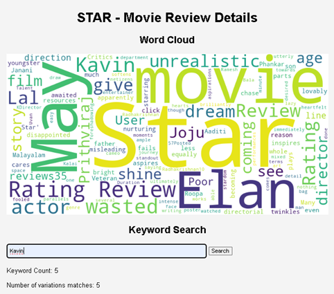

# Movie-Review-Text-Mining-Analytics

This project explores the fascinating world of movie reviews by leveraging Natural Language Processing (NLP) techniques for sentiment analysis and data visualization. Built with Python, this web application allows users to delve into the opinions and emotions surrounding a particular movie.

## Features:

* **Scrape Reviews:** Utilize web scraping libraries to gather reviews from online sources.
* **Sentiment Analysis:** Classify reviews as positive, negative, or neutral using NLP techniques.
* **Visualize Insights:** Generate insightful visualizations like word clouds and sentiment distribution charts to understand the overall sentiment and frequently used terms.
* **Keyword Search:** Empower users to search for specific keywords within the reviews, facilitating focused analysis.

## **Getting Started:**

1. **Prerequisites:** Ensure you have Python (3.x) and the following libraries installed:
   - `requests`
   - `BeautifulSoup4`
   - `nltk`
   - `Matplotlib`
   - `WordCloud`
   - (Optional) Flask (for a web application)

2. **Clone the Repository:**
   ```bash
   git clone https://github.com/S-Subramanian-44/Movie-Review-Text-Mining-Analytics.git
   ```

3. **Run the Script:**
   Navigate to the project directory and execute the main script:

   ```bash
   python movie_review_analysis.py
   ```

   (For a Flask application, follow additional instructions within the code)

## **Functionality Breakdown:**

1. **Scrape Reviews:** The script utilizes libraries like `requests` and `BeautifulSoup4` to interact with websites and fetch movie review snippets. Error handling is implemented to gracefully manage potential issues during the scraping process.

2. **Sentiment Analysis:** Leveraging NLTK's sentiment analysis tools, the script classifies each review as positive, negative, or neutral based on the sentiment score extracted from the text.

3. **Data Cleaning and Summarization:** Regular expressions and language detection techniques are employed to clean the reviews by removing irrelevant elements like dates, ratings, and non-English text. The script then summarizes the cleaned reviews for better analysis.

4. **Word Cloud Generation:** The `WordCloud` library is used to create a visual representation of the most frequently used words within the summarized reviews, offering insights into prominent themes and topics.

5. **Metrics Calculation:** The script calculates precision, recall, and F-score (optional) to evaluate the performance of the sentiment analysis model.

6. **Visualization and Results:** The script generates visualizations like sentiment distribution charts and saves the word cloud image for further exploration.

## Screenshots 

**Movie Search Page:**


**Word Cloud:**



**Sentiment Analysis:**


## **Further Enhancements:**

* **Machine Learning Integration:** Explore advanced NLP techniques like sentiment lexicons or supervised learning models for improved sentiment analysis accuracy.
* **Interactive Web Interface:** Develop a web application using Flask to provide a user-friendly interface for movie selection, sentiment analysis results, and interactive visualizations.
* **Sentiment Lexicon Expansion:** Create a custom sentiment lexicon tailored to movie review terminology for more nuanced sentiment classification.

## Let's Connect!

🌐 LinkedIn: https://www.linkedin.com/in/subramanian-s-ab94302a1/ 
📧 Email: subramanian160104@gmail.com
